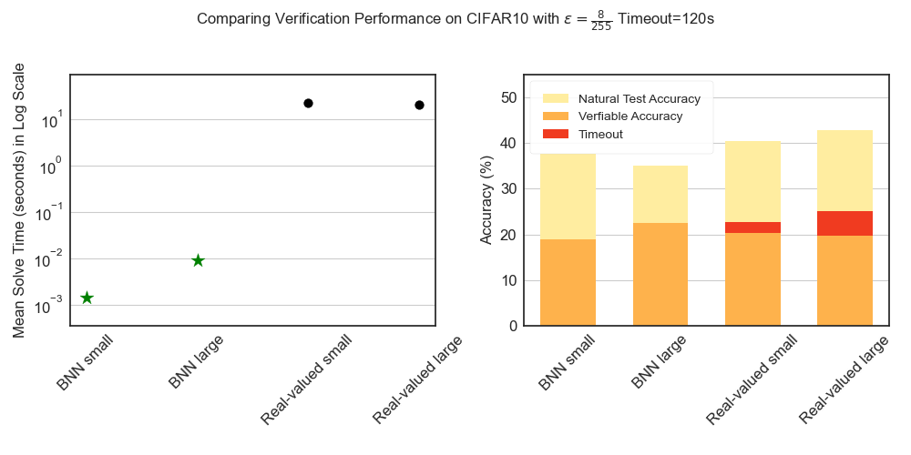

# Efficient Exact Verification of Binarized Neural Networks

This repository is the official implementation of
[EEV](https://arxiv.org/abs/2005.03597), a system for efficient, complete, and
sound verification of binarized neural networks.

Our main contributions:

1. We incorporate native support for reified cardinality constraints into a SAT
   solver, which improves the performance of BNN verification by more than a
   factor of one hundred compared to an unmodified SAT solver.
2. We propose to train solver-friendly BNNs by inducing balanced
   layerwise sparsity and low cardinality bounds.
3. We propose adaptive gradient cancelling to train verifiably robust BNNs with
   the PGD adversary.
4. We present the first exact verification of robustness against Linf-norm
   bounded input perturbations of convolutional BNNs on MNIST and CIFAR10.

Comparing with [a state-of-the-art real-valued
verifier](https://github.com/MadryLab/relu_stable) on CIFAR10:




## Building

The code needs python >= 3.7, and a recent C++ compiler that supports C++17. It
is supposed to be cross-platform, but has only been tested on Arch Linux. The
code is known to work with pytorch 1.4.0 and 1.6.0. Assuming you are starting in
a fresh virtualenv, run the following command to install the dependencies:
```sh
pip install --upgrade pip
pip install tqdm torch torchvision cython opencv-python 'python-sat[pblib,aiger]'
```

[MiniSatCS](https://github.com/jia-kai/minisatcs) is the SAT solver proposed in
this work. It is hosted in another github repository. Please initialize all the
submodules:
```sh
git submodule update --init --recursive
```

Then build MiniSatCS:
```sh
pushd eevbnn/minisatcs
mkdir build
cd build
cmake .. -DCMAKE_BUILD_TYPE=RelWithDebInfo
make -j$(nproc)
popd
```

If you'd like to run the RoundingSat benchmarks, please also build RoundingSat.
Download [soplex-5.0.1.tgz](https://soplex.zib.de/download.php?fname=soplex-5.0.1.tgz)
and place it at `eevbnn/roundingsat_repo`, and then execute
`./eevbnn/roundingsat_build.sh`.

## Usage

The implementation is in the [eevbnn](eevbnn) python package. A few modules have
main functions and can be executed from command line, such as `python -m eevbnn
train_bin` for training or `python -m eevbnn eval_bin` for verification. If you
need to verify your own BNN models using EEV, please have a look at `class
ModelVerifier` in [eevbnn/eval_bin.py](eevbnn/eval_bin.py).  The pretrained
models can be downloaded [here](https://www.dropbox.com/s/xfpiw7o3r841acr/output-0527.tar.xz?dl=0).
To run the verifier:
```sh
# verifying with MiniSatCS and eps=0.08
python -m eevbnn eval_bin -e 0.08 output-0527/mnist-mlp/last.pth

# verifying with RoundingSat
python -m eevbnn eval_bin -e 0.08 output-0527/mnist-mlp/last.pth  --sat roundingsat
```

To reproduce the results in the paper:

1. Run `./train_all_parallel.sh workdir` to train all the models. The script
   assumes two GPUs and uses six processes for parallel training, and you may
   want to modify the `GPU_LIST` and `JOBS` variables. The training tasks are
   described in [train_all_task.txt](train_all_task.txt).
2. Run `./eval_all_parallel.sh workdir` to verify all the models. This script
   assumes the workstation configuration reported in the paper, and you may need
   to modify some variables. The verification tasks are descibed in
   [eval_all_task.txt](eval_all_task.txt).
3. Run `./attack_all_parallel.sh workdir` run the PGD attack.
4. Run `./gen_paper_fig.py workdir workdir/fig` to generate the figures, tables,
   and numbers reported in the paper.


# Citation
```txt
@article{jia2020efficient,
  title={Efficient Exact Verification of Binarized Neural Networks},
  author={Jia, Kai and Rinard, Martin},
  journal={arXiv preprint arXiv:2005.03597},
  year={2020}
}
```
